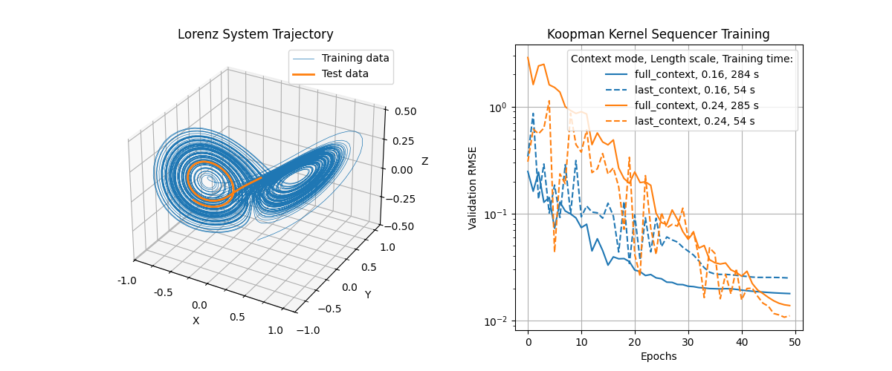

# Koopman Kernel Sequencer

Implementation of the Koopman Kernel Sequencer model.
This model combines Koopman Kernel methods with an architecture that is trained sequentially.

The basic architecture of the `NystroemKoopKernelSequencer` is described in `./examples/intro_koopkernelseq.ipynb`. The model comes in several architectural variants which are briefly discussed. Benchmarking of the variants is done for the chaotic Lorenz attractor in `model_training/train_koopkernel_sequencer.py`, results are plotted in `./examples/lorenz_system.ipynb`. See below for a brief discussion.


## Setup
To install the project, first clone the repository, and then run from the project folder:
```
python -m venv .venv
```
To activate the environment, run
```
source .venv/bin/activate
```
on Mac and Linux, or
```
.venv\Scripts\activate
```
on Windows. Then run
```
pip install -e .
```
to install the project.

To install torch CUDA, please follow the instructions at https://pytorch.org/get-started/locally/ depending on your CUDA version.s

For Compute Platform CUDA 12.6 and higher one can use the following

```
pip3 install torch torchvision torchaudio --index-url https://download.pytorch.org/whl/cu126
```


## Example: Chaotic Lorenz attractor

[Details in `examples/lorenz_system.ipynb`]

The Lorenz attractor is a paradigmatic example of a chaotic system.
We use it to test the potential of the Koopman Kernel Sequencer to capture (highly nonlinear) chaotic dynamics.
The Lorenz attractor is shown in the left plot of the figure below.
The right plot shows validation RMSE for a 50-epochs training of the model.



The right plot shows the RMSE for two different model architectures (`context_mode = full_context, last_context`) and two kernel length scales (`0.16, 0.24`).
In addition, the legend shows the respective training runtimes.
The length scale is a hyperparameter of the kernel function used in the Koopman Kernel Sequencer.
The `context_mode` argument controls how the context window of the time series is used to train the Koopman operator.
For more details see `examples/intro_koopkernelseq.ipynb`.
One observes that the larger length scale results in smaller RMSE values if training is performed sufficiently long.
The option `context_mode = last_context` significantly reduces the required training runtime.
This more efficient model architecture gives almost the same RMSE values along the training trajectory.
